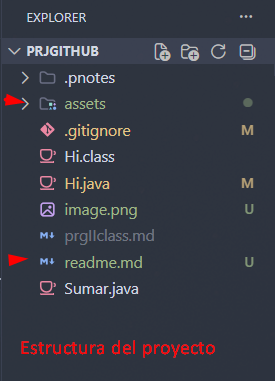
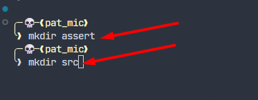

# prj inicial

## estruc. de prj

Proyecto/
│
├── .gitignore          # Configuración para ignorar archivos en Git
├── Hi.class            # Archivo compilado de Java (bytecode)
├── Hi.java             # Código fuente Java mi primer hola mundo
├── Sumar.java          # Otro archivo fuente Java
├── prgIIclass.md       # Documentación en Markdown (probablemente notas de clase)
├── readme.md           # Información general del proyecto
│
└── assets/             # Carpeta destinada a recursos (imágenes, íconos, etc.)

*image* en **negrita**

terminal del **git** personalizada

>.[!NOTE].
> notas

Link
[buscador google](http://google.com)
